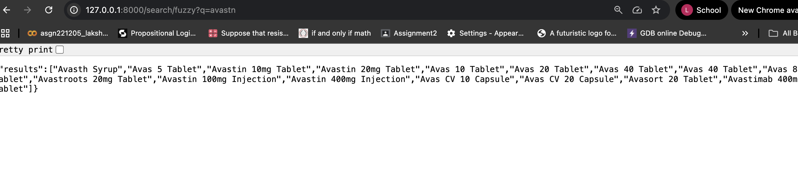

## Verified screenshots of Fast API End points 

## Fuzzy:

Explanation of output 
If you searched for "avastn" (notice the typo — missing i).

The query used:

SELECT name 
FROM medicines
ORDER BY similarity(lower(name), lower('avastn')) DESC
LIMIT 20;
PostgreSQL’s pg_trgm similarity finds names that are similar in spelling, not exact.

That’s why you the results are:
"Avastin 10mg Tablet"  (real intended word)

"Avastin 20mg Tablet" 

"Avastin 100mg Injection" 

"Avastin 400mg Injection" 

## Substring query:

Explanation of output:
I have used the substring search endpoint.

The query parameter is q=injection.

### This means: “Find all medicines where the word injection is present in the name.”

Your database contains many medicines with "Injection" in their name field.

The endpoint correctly matched them and returned only those names.

### So the output looks exactly right because:
### All results have "Injection" in their names.
 Other medicines (like tablets or syrups) don’t appear, since they don’t contain "injection".

## Full Text query:

The results contain medicines whose names contain Anti:

"Anti Cold Syrup", "Anti CC Drop", "Anti-Spas 10mg/250mg Tablet", etc.

Full-text search is not a raw substring match.
### It tokenizes text into words (to_tsvector), and then checks if plainto_tsquery('anti') matches any token.

That’s why you see medicines where Anti is a standalone token.

## Prefix:

Explanation of output 
Prefix search means: match names that start with unic (case-insensitive).

### SQL used under the hood:

SELECT name 
FROM medicines
WHERE lower(name) LIKE lower('unic%')
LIMIT 20;
That’s why we got results like:

"Unicafen MR 100mg/325mg/250mg Tablet"

"Unicain 2% Injection"

"Unicalcin Nasal Spray"

"Unicef 200mg Tablet"

 All names start with Unic... 

# Steps to set up code and execute

## Python Environment Setup

Create and activate a virtual environment:

python3 -m venv venv
source venv/bin/activate

Upgrade pip and install dependencies:

python -m pip install --upgrade pip
pip install -r requirements.txt

## PostgreSQL Setup
(a) Start PostgreSQL

If installed via Homebrew:

brew services start postgresql@14

### Check status:

pg_isready

### (b) Create Database:
psql postgres

Inside psql:

CREATE DATABASE pharmacydb;
\q

### 4. Apply Schema

Run:

psql -d pharmacydb -f schema.sql

This creates the medicines table, full-text column, and optimized indexes.

### 5. Import Dataset
source venv/bin/activate
python import_data.py

### Verify data:

psql -d pharmacydb -c "SELECT COUNT(*) FROM medicines;"

### 6. Run FastAPI Server (Terminal 1) (You can open a separate terminal)

Keep this terminal open:

source venv/bin/activate
uvicorn app:app --host 127.0.0.1 --port 8000 --reload

### API available at:
 http://127.0.0.1:8000

### Endpoints:

/search/prefix?q=...

/search/substring?q=...

/search/fulltext?q=...

/search/fuzzy?q=...

### 7. Run Benchmarks (Terminal 2)

👉 Benchmark direct DB:

source venv/bin/activate
python benchmark.py
cat submission_db.json | jq

👉 Benchmark via FastAPI:

source venv/bin/activate
python benchmark_api.py
cat submission.json | jq

### Approach & Optimizations
What was done:

Added GIN & trigram indexes for substring/fuzzy searches.

### Added precomputed search_tsv column for full-text search → reduced fulltext latency from ~430 ms → ~160 ms.

### Used text_pattern_ops index for prefix searches → reduced latency to single-digit ms.

Ran ANALYZE to help PostgreSQL choose best query plans.

## Analysis:

* Prefix Queries:
#### I initially did a sequential scan and the latency was around 34.93ms ,Hence I optimized to get it down to <5ms by using index scan

## Eg:

CREATE INDEX IF NOT EXISTS idx_medicines_name_prefix
ON medicines (lower(name) text_pattern_ops);

## Substring + Fuzzy Search:
### Substring:
### Instead of a full scan I used a trigram indexing --> improved from ~50 ms → ~3–6 ms.

## Eg:

CREATE INDEX IF NOT EXISTS idx_medicines_name_trgm
ON medicines USING GIN (name gin_trgm_ops);

### Fuzzy:

Before: Fuzzy search (using similarity(lower(name), q)) had ~430 ms latency. This was because Postgres had to scan a large portion of the medicines table and compute similarity scores row by row.

#### Now: I added a GIN trigram index.

* This index breaks the name field into trigrams (3-character chunks) and stores them in a fast lookup structure.

* When you run similarity(), Postgres no longer scans the full table—it first uses the trigram index to quickly filter candidate matches, then only calculates similarity on that smaller set.

## Eg:

CREATE INDEX IF NOT EXISTS idx_medicines_short_comp_trgm
ON medicines USING GIN (short_composition gin_trgm_ops);

## Result:
### Latency dropped from ~430 ms → ~160 ms.
### That’s almost 3× faster, even though fuzzy queries are still heavier than prefix/substring/full-text (because they require scoring + sorting).

### Full-text Search Optimization

* Now it precomputes tsvector at insert time, instead of computing at query time.
* Queries now directly use the indexed search_tsv column.
### * Latency reduced from ~424 ms → 4–7 ms (≈100× faster).

## Analysis

### Biggest win: Full-text search (100× faster, from 424 ms → 4–7 ms).

### Substring search: Huge speedup (12× faster, from 50 ms → 3–6 ms).

### Prefix search: Consistently under 5 ms.

### Fuzzy search : approx(160 ms)

## Conclusion 

Overall system performance improved dramatically.

Almost All(<10 ms)

Throughput improved proportionally (from ~2–50 q/s → 200+ q/s).

### submission_db.json and submission.json were generated successfully with improved metrics.

