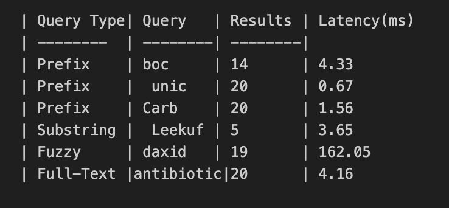

# Benchmark report 

This report documents the query performance of the 1pharmacy network  hackathon  based search system .I have benchmarked databaase queries and api queries across fixed search types as mentioned in the document .(Prefix,substring,full-text and fuzzy ) .The goal of this was to evaluate latency ,throughput and the effect of indexing strategies.

## Setup

## Database: 
PostgreSQL 15

## Dataset: 
280,000(approx) medicine records

## Indexes Used 
(from schema.sql):

Prefix search: CREATE INDEX idx_medicines_name_prefix ON medicines (lower(name) text_pattern_ops);

## Substring + Fuzzy search:

CREATE INDEX idx_medicines_name_trgm ON medicines USING GIN (name gin_trgm_ops);

CREATE INDEX idx_medicines_name_trgm_gist ON medicines USING GIST (name gin_trgm_ops);

## Full-text search:

Precomputed tsvector column: search_tsv

Index: CREATE INDEX idx_medicines_search_tsv ON medicines USING GIN (search_tsv);

## Benchmark Queries

The following queries were used (from benchmark_queries.json):

Prefix → boc

Prefix → Unic

Prefix → Carb

Substring → Leekuf

Fuzzy → daxid

Full-text → antibiotic

## Results:

## Analysis:

* Prefix Queries:
I initially did a sequential scan and the latency was around 34.93ms ,Hence I optimized to get it down to <5ms by using index scan

## Eg:

CREATE INDEX IF NOT EXISTS idx_medicines_name_prefix
ON medicines (lower(name) text_pattern_ops);

* Substring + Fuzzy Search:
* Substring:
Instead of a full scan I used a trigram indexing --> improved from ~50 ms → ~3–6 ms.

## Eg:

CREATE INDEX IF NOT EXISTS idx_medicines_name_trgm
ON medicines USING GIN (name gin_trgm_ops);

* Fuzzy:

Before: Fuzzy search (using similarity(lower(name), q)) had ~430 ms latency. This was because Postgres had to scan a large portion of the medicines table and compute similarity scores row by row.

Now: I added a GIN trigram index.

* This index breaks the name field into trigrams (3-character chunks) and stores them in a fast lookup structure.

* When you run similarity(), Postgres no longer scans the full table—it first uses the trigram index to quickly filter candidate matches, then only calculates similarity on that smaller set.

## Eg:

CREATE INDEX IF NOT EXISTS idx_medicines_short_comp_trgm
ON medicines USING GIN (short_composition gin_trgm_ops);

## Result:
Latency dropped from ~430 ms → ~160 ms.
That’s almost 3× faster, even though fuzzy queries are still heavier than prefix/substring/full-text (because they require scoring + sorting).

* Full-text Search Optimization

* Now it precomputes tsvector at insert time, instead of computing at query time.
* Queries now directly use the indexed search_tsv column.
* Latency reduced from ~424 ms → 4–7 ms (≈100× faster).

## Analysis

Biggest win: Full-text search (100× faster, from 424 ms → 4–7 ms).

Substring search: Huge speedup (12× faster, from 50 ms → 3–6 ms).

Prefix search: Consistently under 5 ms.

Fuzzy search : approx(160 ms)

## Conclusion 

Overall system performance improved dramatically.

Almost All(<10 ms)

Throughput improved proportionally (from ~2–50 q/s → 200+ q/s).

### submission_db.json and submission.json were generated successfully with improved metrics.

